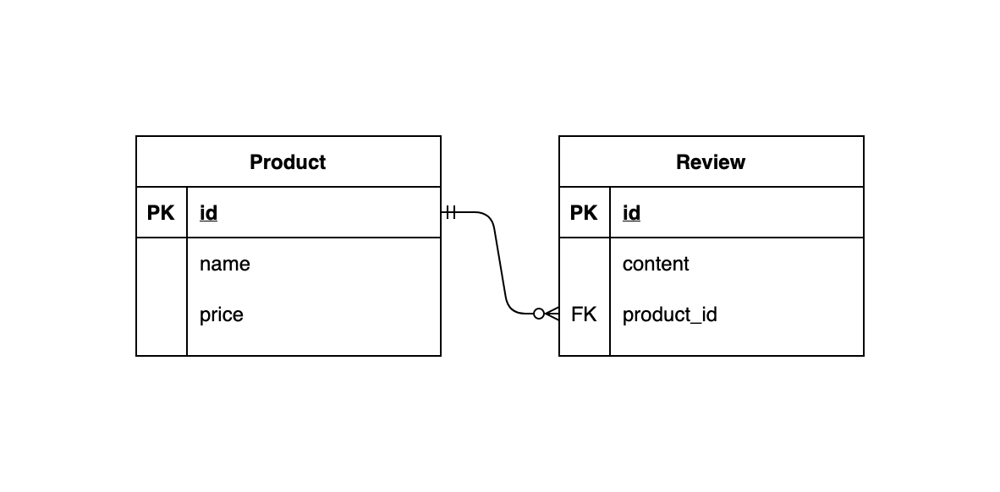

# Product Review - Reactive REST API

## 개요

- 상품을 관리하고 상품의 리뷰를 조회, 생성 및 삭제 할 수 있는 Reactive REST API Application 구현

## 목표

- Spring WebFlux 및 Spring Data R2DBC를 활용한 Reactive REST API의 설계

## 준비 사항

- Spring Boot >= 2.6.0
  - Spring WebFlux
  - Spring Data R2DBC
- DBMS (택 1 / Docker 또는 Local 설치)

    - MySQL Server >= 8.0 (Docker)
        - Docker

            ```bash
            $ docker run --name project-02 \
              -e MYSQL_ROOT_PASSWORD=root \
              -e MYSQL_USER=coupang \
              -e MYSQL_PASSWORD=coupang \
              -e MYSQL_DATABASE=project-02 \
              -p 3306:3306 -d mysql:8.0
            ```

    - PostgreSQL >= 13
        - Docker

            ```bash
            $ docker run --name project-02 \
              -e POSTGRES_USER=coupang \
              -e POSTGRES_PASSWORD=coupang \
              -e POSTGRES_DB=project-02 \
              -p 5432:5432 -d postgres:13
            ```


## 요구 사항

### 0. 주의 사항

- 'Request 예시', 'Response 예시' 및 '구현 예시'는 참고 용도로만 제공되는 것이며, 반드시 **똑같이 구현할 필요 없음**
- 아래 명세에 명시되지 않은 내용은 **자유롭게** 구현

### 1. Database Scheme

- 상품(Product)은 상품명(name)과 가격(price)으로 구성
- 리뷰(Review)는 내용(content)과 어떤 상품의 리뷰인지(product_id)에 대한 값으로 구성
- Entity Relationship Diagram (ERD)

    

### 2. Endpoints

- `GET /products`
    - 모든 상품 조회
    - Response 예시

        ```json
        [
            {
                "id": 1,
                "name": "물",
                "price": 1000,
                "reviews": []
            },
            {
                "id": 2,
                "name": "콜라",
                "price": 5000,
                "reviews": [
                    {
                        "id": 1,
                        "content": "너무 비싸요 :("
                    }
                ]
            }
        ]
        ```

- `POST /products`
    - 새 상품 생성
    - Request Body
        - (필수) `name` - 상품명
        - (필수) `price` - 가격
    - Request 예시
        - `POST /products`

            ```json
            {
                "name": "물",
                "price": 1000
            }
            ```

    - Response 예시

        ```json
        {
            "id": 1,
            "name": "물",
            "price": 1000,
            "reviews": []
        }
        ```

- `GET /products/{id}`
    - 특정 상품 정보 조회
    - Request 예시
        - `GET /products/1`
    - Response 예시

        ```json
        {
            "id": 1,
            "name": "물",
            "price": 1000,
            "reviews": []
        }
        ```

- `PUT /products/{id}`
    - 특정 상품 정보 수정(업데이트)
    - Request Body
        - (필수) `name` - 상품명
        - (필수) `price` - 가격
    - Request 예시
        - `PUT /products/1`

            ```json
            {
              "name": "물",
              "price": 2000
            }
            ```

    - Response 예시

        ```json
        {
            "id": 1,
            "name": "물",
            "price": 2000,
            "reviews": []
        }
        ```

- `DELETE /products/{id}`
    - 특정 상품 삭제
    - Request 예시
        - `DELETE /products/1`
    - Response 예시
        - 204 No Content

- `POST /products/{product_id}/reviews`
    - 특정 상품의 리뷰 생성
    - Request Body
        - (필수) `content` - 리뷰 내용
    - Request 예시
        - `POST /products/1/reviews`

            ```json
            {
                "content": "너무 비싸요 :("
            }
            ```

    - Response 예시

        ```json
        {
            "id": 1,
            "content": "너무 비싸요 :(",
            "product": {
                "id": 1,
                "name": "물",
                "price": 2000
            }
        }
        ```

- `DELETE /products/{product_id}/reviews/{id}`
    - 특정 리뷰 삭제
    - Request 예시
        - `DELETE /products/1/reviews/2` - id가 1인 상품의 리뷰 중에서, id가 2인 리뷰 삭제
    - Response 예시
        - 204 No Content


## 제출 방법

- Git을 통해 프로젝트 URL의 GitHub repository를 로컬로 clone

    ```bash
    $ git clone https://github.com/coupang-edu/a4e-spring-security-project-02
    $ cd a4e-spring-security-project-02
    ```

- 본인의 영문명으로 branch 생성 및 이동

    ```bash
    $ git switch -c john
    ```

- 코드 작성이 완료된 프로젝트를, 아래와 같이 프로젝트 폴더명을 본인의 영문명으로 변경

    ```bash
    README.md
    john/
        ├── gradle/
        ├── src/
        ├── build.gradle
        ├── gradlew
        ├── gradlew.bat
        └── settings.gradle
    ```

- 코드 작성 완료 후, 해당 branch를 push

    ```bash
    $ git push origin john
    ```

- Pull Request 생성하여 제출 완료
